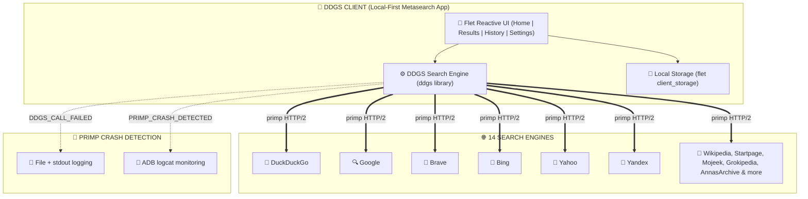

  

  Dux Distributed Global Search — Metasearch across 14 engines with full DuckDuckGo privacy

  
  
  
  

---

## Download

| Platform | Download | Notes |
| :---: | :---: | :--- |
| 🤖 **Android** |  | Recommended for Android mobile users |

### Android Architecture Build Splits

| Variant | Download | Notes |
| :--- | :---: | :--- |
| 📱 **ARM64** (most phones) | [**ddgs-arm64-v8a.apk**](https://github.com/Nwokike/DDGS/releases/latest/download/ddgs-arm64-v8a.apk) | Modern 64-bit Android devices |
| 📱 **ARMv7** (older phones) | [**ddgs-armeabi-v7a.apk**](https://github.com/Nwokike/DDGS/releases/latest/download/ddgs-armeabi-v7a.apk) | Legacy 32-bit Android devices |
| 💻 **x86_64** (emulators) | [**ddgs-x86_64.apk**](https://github.com/Nwokike/DDGS/releases/latest/download/ddgs-x86_64.apk) | Chromebooks & Android emulators |

---

## Core Capabilities

| Capability | Description |
| :--- | :--- |
| **14 Search Engines** | Simultaneously queries Brave, DuckDuckGo, Google, Bing, Yahoo, Yandex, Startpage, Mojeek, Wikipedia, Grokipedia, and more. |
| **All Media Types** | Search the web, images, videos, news, and books — all in one app. |
| **Page Extraction** | Extract any webpage as Markdown, plain text, rich text, raw HTML, or binary content. |
| **Backend Selection** | Choose specific search engines or let Auto pick the best combination. |
| **Time Filters** | Filter results by day, week, month, or year. |
| **Safe Search** | Three levels: off, moderate, and strict content filtering. |
| **Full Transparency** | Every search is logged for debugging. No data leaves your device. |
| **Privacy-First** | No tracking, no logging, no middleman. Direct connections from your device. |

---

## Features

- **Privacy-First Metasearch** — No tracking, no logging, no middleman. Direct connections from your device to the search engines.
- **All DDGS Capabilities** — Web, images, videos, news, books, and page extraction — every DDGS method exposed.
- **Backend Selection** — Choose from 14 search engines or let Auto select the best combination.
- **Time Filters** — Filter by day, week, month, or year for any search type.
- **Safe Search** — Three levels of content filtering (off, moderate, strict).
- **Proxy & SSL Config** — Configure proxy and SSL verification for network-restricted environments.
- **Thread Control** — Adjust max threads for performance tuning.
- **Page Extraction** — Extract any URL as Markdown, plain text, rich text, raw HTML, or binary content.
- **Full Debug Logging** — Every DDGS call, every error, every performance metric logged to file and stdout for primp crash investigation.
- **Ruff Compliance** — Clean, formatted, and strictly linted Python codebase.

---

## Architecture

| Layer | Technology | Purpose |
| :--- | :--- | :--- |
| **Frontend** | Flet (Flutter engine) | Cross-platform UI with clean responsive views and smooth page transitions |
| **Search Core** | `ddgs` (DDGS library) | Metasearch engine aggregating results from 14 providers |
| **HTTP Client** | `primp` (Rust-based) | Fast async HTTP/2 client with browser emulation and TLS fingerprinting |
| **Local Storage** | Flet Client Storage | Ultra-fast local key-value storage for settings, theme state, and logs |
| **Async Runtime** | `asyncio` + `threading` | Thread-safe progress reporting with cancellation support |

### Visual Flow

---

## Search Performance Guide

| Search Type | Backend | Typical Results |
| :--- | :---: | :--- |
| **Web** | Auto (all engines) | 20-100 results in 2-5 seconds |
| **Images** | DuckDuckGo / Bing | 20-60 results in 1-3 seconds |
| **Videos** | DuckDuckGo | 10-30 results in 1-3 seconds |
| **News** | DuckDuckGo / Bing / Yahoo | 20-50 results in 1-3 seconds |
| **Books** | Anna's Archive | 10-20 results in 2-4 seconds |
| **Page Extract** | Direct HTTP fetch | Instant content extraction |

---

## Privacy & Security

DDGS is designed with a strict **Privacy-First** philosophy:

1. **Local Connections**: All searches are sent directly from your own device IP address. No middleman, proxy, or server tracking.
2. **Zero Logging**: We do not log, track, or share your search history, queries, or results.
3. **No Account Required**: No sign-up, no tracking cookies, no personal data collection.
4. **Full Configurability**: Proxy support, SSL verification toggle, and backend selection give you full control.

---

## Legal Disclaimer

DDGS is a metasearch tool that aggregates results from public search engines. It does not store, cache, or redistribute search results. Users are solely responsible for ensuring compliance with target search engines' Terms of Service and local privacy regulations (e.g. GDPR, CCPA). The authors take no responsibility for misuse of this tool.