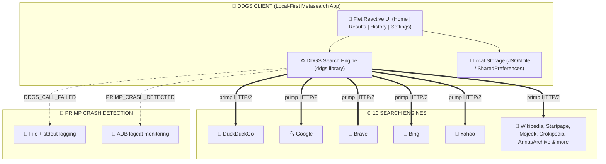

  

<h1 align="center">Search everything. Download anything.</h1>

  Private search across 10 engines — download videos &amp; images, 
  scrape any page as Markdown, HTML or text, no account, no tracking.

  
  
  
  

---

## Download

### Which version do I need?

| Feature | Google Play Store | GitHub (APK / Windows / Linux) |
| :--- | :---: | :---: |
| Private multi-source search (web, images, videos, news, books) | ✅ | ✅ |
| Scrape any page → Markdown / HTML / rich text / plain text / raw source, saved to file | ✅ | ✅ |
| Download images to your device | ✅ | ✅ |
| Video downloads with quality picker (best / 1080p / 720p / 480p / 360p) | ✅ (non-YouTube sources) | ✅ |
| **YouTube video downloads** | ❌ disabled to comply with Play policy | ✅ **full** |
| Desktop builds (Windows / Linux) + in-app updates from GitHub | — (Android only) | ✅ |

> **The Play Store edition** exists for users who can't install apps from
> elsewhere and carries the restrictions Google Play requires. **Most users who
> can should use the GitHub build** — it's the full, unrestricted experience
> (the same app, signed with the same key).

| Platform | Download | Notes |
| :---: | :---: | :--- |
| 🤖 **Android (full)** |  | **Full version** — all sources, including YouTube downloads |
| 🤖 **Android (Play)** |  | Policy edition — YouTube downloads disabled |
| 🪟 **Windows** |  | Automated standalone setup installer with desktop shortcut |
| 🐧 **Linux (Debian/Ubuntu)** |  | Tailored for Ubuntu, Debian, Linux Mint & Pop!_OS |
| 🎩 **Linux (Fedora/RHEL)** |  | Tailored for Fedora, openSUSE, RHEL & CentOS |
| 📦 **Linux (Universal)** |  | Portable archive for Arch, Alpine, Steam Deck & all distros |

### Android builds (GitHub edition)

| Variant | Download | Notes |
| :--- | :---: | :--- |
| 📱 **ARM64** (most phones) | [**ddgs-arm64-v8a.apk**](https://github.com/Nwokike/DDGS/releases/latest/download/ddgs-arm64-v8a.apk) | Modern 64-bit Android devices — **full downloads** |
| 📱 **ARMv7** (older phones) | [**ddgs-armeabi-v7a.apk**](https://github.com/Nwokike/DDGS/releases/latest/download/ddgs-armeabi-v7a.apk) | Legacy 32-bit Android devices |
| 💻 **x86_64** (emulators) | [**ddgs-x86_64.apk**](https://github.com/Nwokike/DDGS/releases/latest/download/ddgs-x86_64.apk) | Chromebooks & Android emulators |

---

## What you can do

### 📥 Download videos and images — not just view them

Open any video result and tap **Download Video**: pick your quality
(best / 1080p / 720p / 480p / 360p), choose where to save it, watch real
progress with a cancel button, and get the file on your device — YouTube
downloads are resolved to the direct file in the full edition, and other
video sources are fetched as-is. Image results save with one tap through the
same save dialog. Filenames are cleaned up automatically, and a cancelled
download never leaves a broken file behind.

### 🕷️ Scrape any page, save it in any format

Paste a URL into the **Extract** tab (or open any result) and get the page
back as clean, structured content — **Markdown, HTML, rich text, plain text,
or raw source** — read it in the built-in reader (links are tappable, with a
back stack), switch formats on the fly, and save it to your device as a file.

> **For developers &amp; agent builders:** DDGS is a scraper you can point at
> any URL. Pull clean **Markdown or HTML** straight out of a page and pipe it
> into your notes workflow, CMS, archive, or AI agent — no browser automation,
> no boilerplate, one tap from search result to file.

### 🔍 Private search across 10 engines

One search box queries **DuckDuckGo, Google, Brave, Yahoo, Startpage, Mojeek,
Wikipedia and Grokipedia** for web results, plus **Bing** for images/news and
**Anna's Archive** for books — across **web, images, videos, news and books**.
No account, no sign-up, no profiling. Searches go directly from your device to
the sources you choose, and your history stays on your device (clear it any
time).

### 🎛️ Pro filters without the complexity

- **Image filters** — size, color, type (photo/clipart/GIF/transparent/line), layout, license
- **Video filters** — resolution, duration, license
- **13 regions**, safe search (off/moderate/strict), time filters (day/week/month/year)
- Result count up to 100, and your own choice of search source per category

### 🔗 Share, copy, open — one tap

Every result opens in a sheet with **Open · Copy URL · Share** — the native
share sheet sends the result to any app on your device. Search history reruns
with a single tap.

**Free with ads** — ads keep DDGS free; they never see your queries, and your
history and logs never leave your device.

Runs on **Android, Windows and Linux** (light/dark/system theme, offline
detection, in-app updates).

---

## Screenshots

### Mobile Home Dashboard

<table>
  <tr>
    <td width="50%"></td>
    <td width="50%"></td>
  </tr>
  <tr>
    <td align="center"><em>Home Dashboard (Light Mode) — Clean search categories grid and parameters bar.</em></td>
    <td align="center"><em>Home Dashboard (Dark Mode) — Sleek slate-black interface displaying recent queries.</em></td>
  </tr>
</table>

### Search Results Views

<table>
  <tr>
    <td width="33%"></td>
    <td width="33%"></td>
    <td width="33%"></td>
  </tr>
  <tr>
    <td align="center"><em>Web Search — Clean card-based metasearch results with integrated sponsored ads.</em></td>
    <td align="center"><em>Image Grid — 2-column scrollable image search with dimension overlays.</em></td>
    <td align="center"><em>Video Index — Rich streaming lists with video duration tags and view counts.</em></td>
  </tr>
</table>

### Page Extraction & News Results

<table>
  <tr>
    <td width="50%"></td>
    <td width="50%"></td>
  </tr>
  <tr>
    <td align="center"><em>Page Extraction — Rendered Markdown reader with source link browser launching.</em></td>
    <td align="center"><em>News Results — Live news feed with publisher details and thumbnails.</em></td>
  </tr>
</table>

### Advanced Settings & History

<table>
  <tr>
    <td width="33%"></td>
    <td width="33%"></td>
    <td width="33%"></td>
  </tr>
  <tr>
    <td align="center"><em>Theme & Rules — Safe-search toggles, max results slider, and region filters.</em></td>
    <td align="center"><em>Sources & Downloads — Preferred video qualities and page-save formats.</em></td>
    <td align="center"><em>Proxies & Diagnostics — Network proxy configurations and live activity logs terminal.</em></td>
  </tr>
</table>

  

<em>Local Search History (Light Mode) — Chronological log of recent search queries and extraction runs with clear-all controls and instant rerun shortcuts.</em>

---

## Privacy & Security

DDGS is built on a strict **Privacy-First** philosophy:

1. **No account, ever** — no sign-up, no login cookies, no personal data collection.
2. **Searches go direct** — queries travel straight from your device to the search sources you chose. We don't run a server in the middle and we don't profile you; no ad profiling by us either.
3. **Everything stays on-device** — history, settings and logs live in local storage on your device and can be cleared from Settings at any time.
4. **Transparent network calls** — the app checks for updates (once per launch) and, on the free ad-supported build, loads ads. Nothing else phones home.
5. **Fully configurable** — proxy support and an SSL-verification toggle for restricted networks; you choose the engines, region and safe-search level.

---

## Legal Disclaimer

DDGS is a metasearch and content-extraction tool that queries public search
engines and retrieves publicly available pages. It does not store, cache, or
redistribute search results. **Only download or save content you have the
right to** — respect the terms of service and copyright of the sites you
visit, and note that some sources (including YouTube) restrict downloading in
their terms. Users are solely responsible for compliance with target sites'
Terms of Service and local privacy regulations (e.g. GDPR, CCPA). The authors
take no responsibility for misuse of this tool.

---

<b>For developers — architecture, performance &amp; stack</b>

### Architecture

| Layer | Technology | Purpose |
| :--- | :--- | :--- |
| **Frontend** | Flet 1.0 (Flutter engine) | Cross-platform UI with clean responsive views and smooth page transitions |
| **Search Core** | `ddgs` (DDGS library) | Metasearch engine aggregating results from 10 providers |
| **HTTP Client** | `primp` (Rust-based) | Fast async HTTP/2 client with browser emulation and TLS fingerprinting |
| **Local Storage** | JSON file / SharedPreferences | Local key-value storage for settings and history (SharedPreferences on web) |
| **Async Runtime** | `asyncio` + `threading` | Thread-safe progress reporting with cancellation support |

### Visual Flow

### Search Performance Guide

| Search Type | Backend | Typical Results |
| :--- | :---: | :--- |
| **Web** | Auto (all engines) | 20-100 results in 2-5 seconds |
| **Images** | DuckDuckGo / Bing | 20-60 results in 1-3 seconds |
| **Videos** | DuckDuckGo | 10-30 results in 1-3 seconds |
| **News** | DuckDuckGo / Bing / Yahoo | 20-50 results in 1-3 seconds |
| **Books** | Anna's Archive | 10-20 results in 2-4 seconds |
| **Page Extract** | Direct HTTP fetch | Instant content extraction |

---

## Credits

- **Search core:** the [`ddgs`](https://github.com/deedy5/ddgs) library (MIT) by deedy5
- **HTTP client:** [`primp`](https://github.com/deedy5/primp) (Rust, HTTP/2)
- **UI:** [Flet](https://flet.dev) (Flutter engine)
