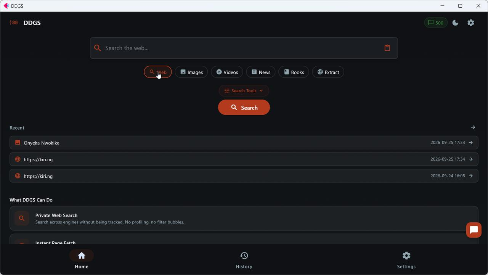
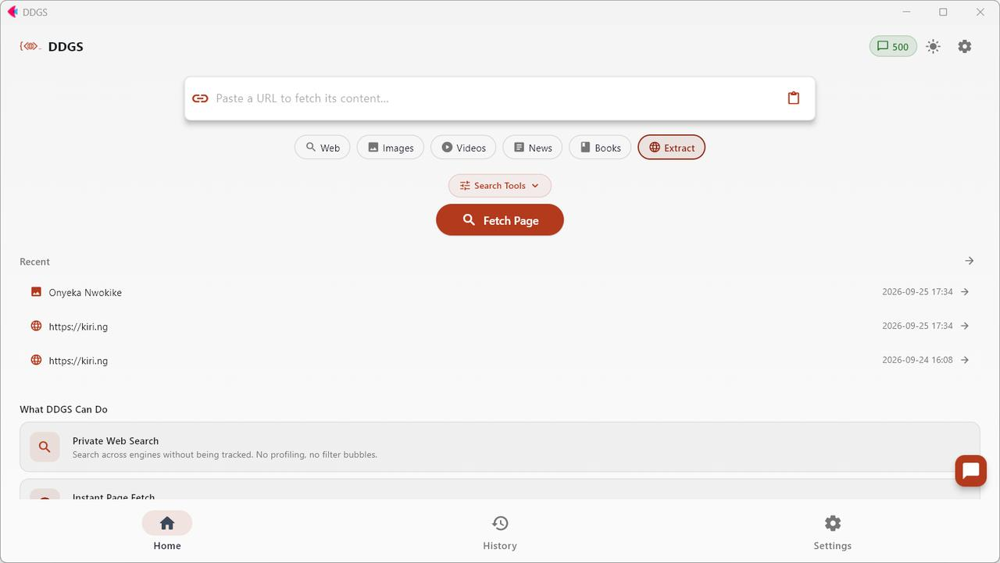
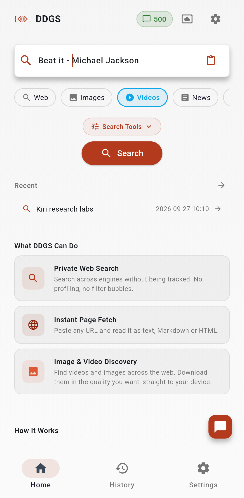
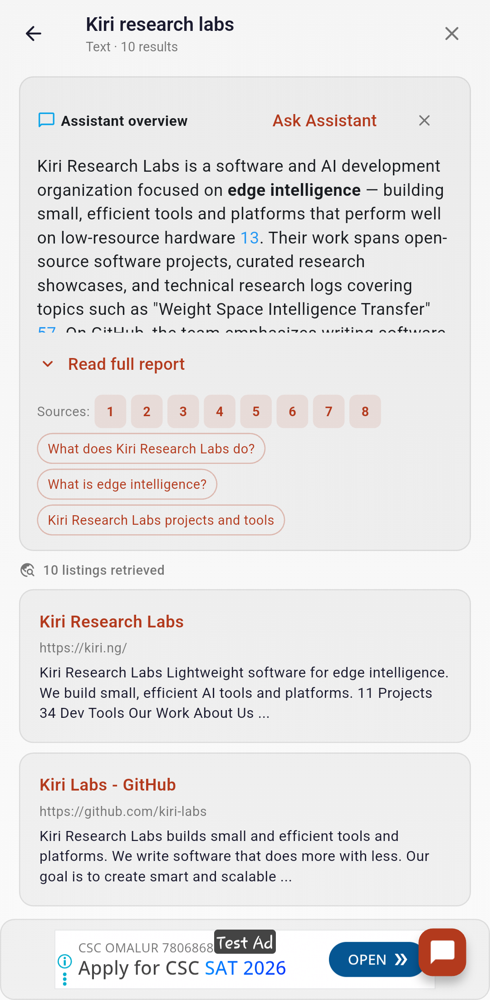
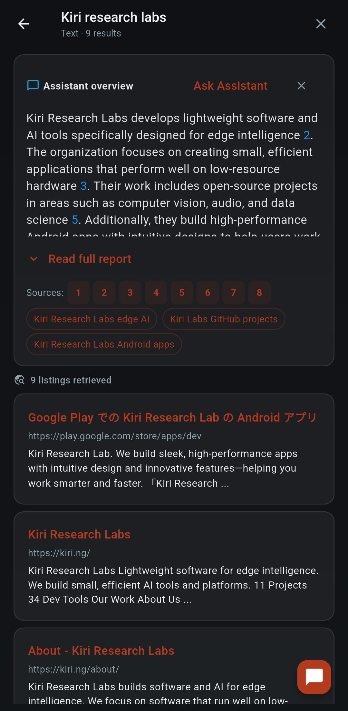
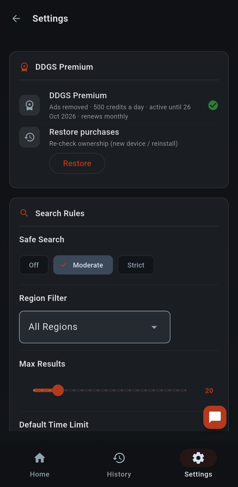
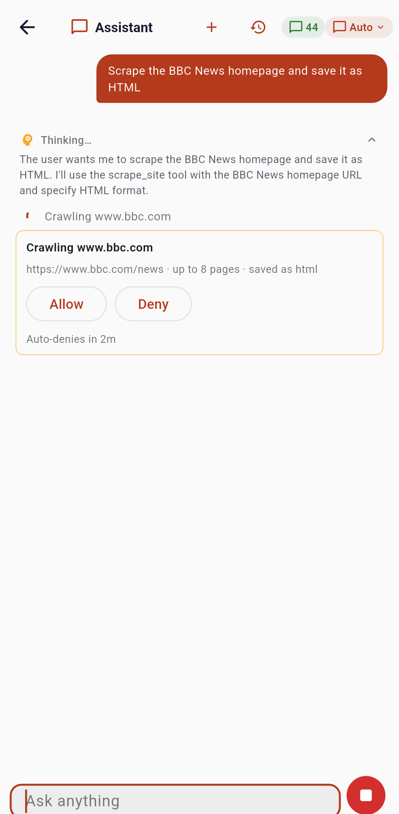
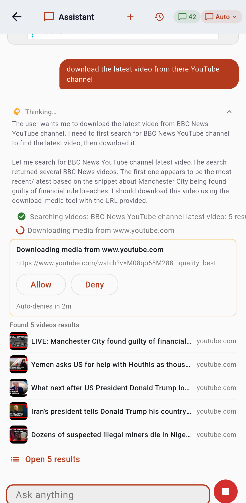
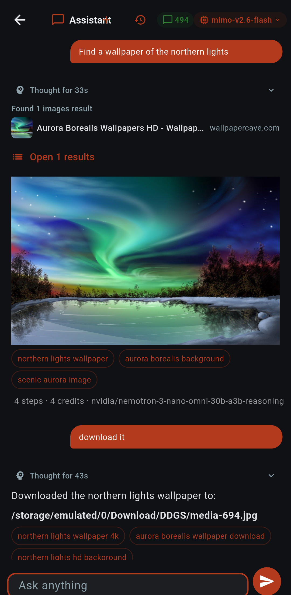
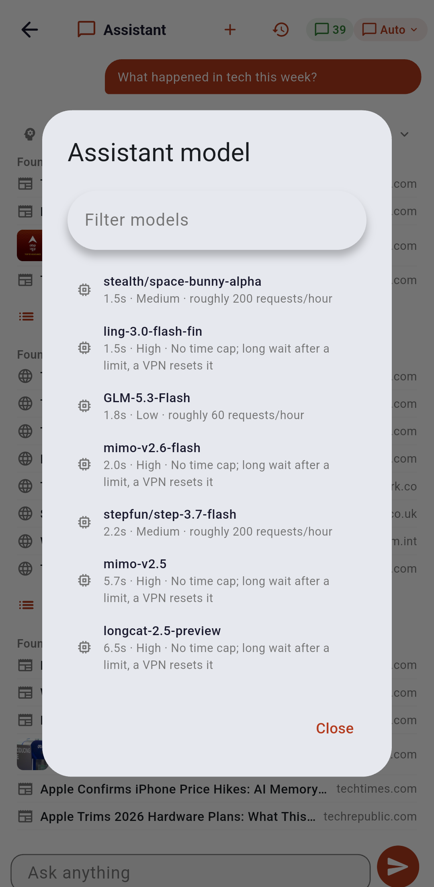

<p align="center">
  
</p>

<h1 align="center">Search everything. Download anything.</h1>

<p align="center">
  Automated private search across 10 engines: download videos &amp; images,<br>
  scrape any page as Markdown, HTML or text, and let the Assistant do the work.
</p>

<p align="center">
  <a href="https://play.google.com/store/apps/details?id=ng.kiri.ddgs"></a>
  <a href="#download"></a>
  <a href="#download"></a>
  
  
</p>

---

## Core Capabilities

| Capability | What it does |
| :--- | :--- |
| **Video downloads** | Quality picker (best / 1080p / 720p / 480p / 360p), live progress, cancel-safe. YouTube resolves to the direct file in the GitHub edition |
| **Image downloads** | One tap from any image result, filenames cleaned automatically |
| **Any-format scraping** | Extract a page as Markdown, HTML, rich text, plain text or raw source and save it to a file |
| **10 search engines** | DuckDuckGo, Google, Brave, Yahoo, Startpage, Mojeek, Wikipedia, Grokipedia (web), Bing (images/news), Anna's Archive (books) |
| **Pro filters** | Image size/color/type, video resolution/duration, 13 regions, safe search, time filters, up to 100 results |
| **The Assistant** | An agent that searches, fetches, saves and schedules for you, with an approve gate before anything is written |
| **Credits** | 50/day free, 500/day with Premium; a receipt on every answer; low balance never blocks work mid-turn |
| **Local-first** | History, settings and logs stay on your device. No account, no sign-up |

---

## Download

### Which version do I need?

| Feature | Google Play Store | GitHub (APK / Windows / Linux) |
| :--- | :---: | :---: |
| Private multi-source search (web, images, videos, news, books) | ✅ | ✅ |
| Scrape any page → Markdown / HTML / rich text / plain text / raw source | ✅ | ✅ |
| Download images to your device | ✅ | ✅ |
| Video downloads with quality picker | ✅ (non-YouTube sources) | ✅ |
| **YouTube video downloads** | ❌ disabled to comply with Play policy | ✅ **full** |
| Desktop builds (Windows / Linux) + in-app updates from GitHub | N/A (Android only) | ✅ |
| **DDGS Premium**: ad-free + 500 AI credits/day | ❌ not sold (free with ads) | ✅ in-app checkout: card, bank transfer, USDC |

> **Most users who can should use the GitHub build**: it is the full, unrestricted experience, signed with the same key. The Play edition exists for users who can only install from the store and carries the restrictions Google Play requires.

| Platform | Download | Notes |
| :---: | :---: | :--- |
| 🤖 **Android (full)** | [](#android-builds-github-edition) | **Full version**: all sources, including YouTube downloads |
| 🤖 **Android (Play)** | [](https://play.google.com/store/apps/details?id=ng.kiri.ddgs) | Policy edition: YouTube downloads disabled |
| 🪟 **Windows** | [](https://github.com/Nwokike/DDGS/releases/latest/download/DDGS.exe) | Standalone setup installer with desktop shortcut |
| 🐧 **Linux (Debian/Ubuntu)** | [](https://github.com/Nwokike/DDGS/releases/latest/download/DDGS.deb) | Ubuntu, Debian, Linux Mint, Pop!_OS |
| 🎩 **Linux (Fedora/RHEL)** | [](https://github.com/Nwokike/DDGS/releases/latest/download/DDGS.rpm) | Fedora, openSUSE, RHEL, CentOS |
| 📦 **Linux (Universal)** | [](https://github.com/Nwokike/DDGS/releases/latest/download/DDGS.tar.gz) | Portable archive for any distro |

#### Android builds (GitHub edition): per-architecture APKs

| Variant | Download | Notes |
| :--- | :---: | :--- |
| 📱 **ARM64** (most phones) | [**ddgs-arm64-v8a.apk**](https://github.com/Nwokike/DDGS/releases/latest/download/ddgs-arm64-v8a.apk) | Modern 64-bit Android, **full downloads** |
| 📱 **ARMv7** (older phones) | [**ddgs-armeabi-v7a.apk**](https://github.com/Nwokike/DDGS/releases/latest/download/ddgs-armeabi-v7a.apk) | Legacy 32-bit devices |
| 💻 **x86_64** (emulators) | [**ddgs-x86_64.apk**](https://github.com/Nwokike/DDGS/releases/latest/download/ddgs-x86_64.apk) | Chromebooks, Android emulators |

---

## Screenshots

### Desktop

<p align="center">
  
</p>
<p align="center"><em>Home in dark mode: search-first layout, category tabs, recent searches, capability cards</em></p>

<p align="center">
  
</p>
<p align="center"><em>Extract mode in light theme: paste any URL and read it as Markdown, HTML or text</em></p>

### Mobile

<table>
  <tr>
    <td width="50%"></td>
    <td width="50%"></td>
  </tr>
  <tr>
    <td align="center"><em>Home with search tools and recents</em></td>
    <td align="center"><em>Results with the Assistant overview, sources and related searches (light)</em></td>
  </tr>
</table>

<table>
  <tr>
    <td width="50%"></td>
    <td width="50%"></td>
  </tr>
  <tr>
    <td align="center"><em>Assistant overview in dark mode</em></td>
    <td align="center"><em>Premium active: 500 credits a day, ads removed</em></td>
  </tr>
</table>

<table>
  <tr>
    <td width="50%"></td>
    <td width="50%"></td>
  </tr>
  <tr>
    <td align="center"><em>Assistant crawling a site, one approval before it writes</em></td>
    <td align="center"><em>Give it a mission: search, pick and download a video</em></td>
  </tr>
</table>

<table>
  <tr>
    <td width="50%"></td>
    <td width="50%"></td>
  </tr>
  <tr>
    <td align="center"><em>File saved straight to your device</em></td>
    <td align="center"><em>Live model catalog with rate hints</em></td>
  </tr>
</table>

---

## The Assistant

Turn on **Assistant mode** in Settings and an **Ask Assistant** button appears on the search screen. It is an agent that **acts, not just explains**:

- **Searches and cites**: web, images, videos, news, books, with tappable citations and related searches.
- **Acts with approval**: save pages as Markdown/HTML/text, download video (YouTube included) or images, crawl a site, schedule recurring crawls. Each asks once before writing.
- **1 credit per model step** with a receipt on every answer. Overviews and summaries are free; manual search and downloads never use credits; a low balance never stops a turn mid-way.
- **Runs on your router**: in-app Kiri router first (free models, your IP), Kiri gateway only if it is down. The model picker shows the live catalog with rate hints; `auto` rotates across healthy models.

**DDGS Premium:** **$3.99/mo · $24.99/yr · $49.99 lifetime** (direct APK and desktop). Premium raises credits to **500/day** and removes ads on mobile.

---

## Privacy & Security

1. **No account, ever.** No sign-up, no login, no personal data collection.
2. **Searches go direct**: your device to the sources you chose. No server in the middle, no profiling by us.
3. **Everything stays on-device**: history, settings and logs, clearable from Settings.
4. **Transparent network calls**: update check once per launch, ads on the free build, and Assistant queries to your in-app router first (Kiri gateway fallback), with no training on your data.
5. **Configurable**: proxy support, SSL toggle, your choice of engines, region and safe search.

---

## Legal Disclaimer

DDGS is a metasearch and content-extraction tool for public search engines and publicly available pages. It does not store, cache or redistribute results. **Only download or save content you have the right to**: respect each site's terms and copyright (including YouTube's restrictions on downloading). Users are solely responsible for compliance with target sites' Terms of Service and local privacy regulations. The authors take no responsibility for misuse of this tool.

---

## Development

```bash
uv sync --frozen     # install exactly what uv.lock pins (includes dev tools)
uv run ruff check src tests
uv run pytest -q     # 268 tests
uv run flet run      # desktop app
```

CI builds every platform on a `v*` tag: quality gate (frozen sync, version
consistency, ruff, pytest) then Android split APKs, Windows installer and
Linux DEB/RPM/TAR. The Play AAB builds from the `playstore` branch with the
build channel stamped in.

**Version policy:** `pyproject.toml` is the single source of truth; CI fails
on any drift. `version.json` (the in-app update feed) is deliberately held
back until the Play AAB upload ships: CI prints a NOTICE while it lags and
fails if it ever runs ahead of the app.

| Layer | Technology |
| :--- | :--- |
| Frontend | Flet 1.0.1 (Flutter engine) |
| Search core | `ddgs` 9.16.0 across 10 providers |
| HTTP | `primp` (Rust, HTTP/2 with browser emulation) |
| Assistant | in-app Kiri router first, Kiri gateway fallback |
| Storage | on-device JSON (settings, history, conversations) |

---

## Credits

- **Search core:** the [`ddgs`](https://github.com/deedy5/ddgs) library (MIT) by deedy5
- **HTTP client:** [`primp`](https://github.com/deedy5/primp) (Rust, HTTP/2)
- **UI:** [Flet](https://flet.dev) (Flutter engine)
